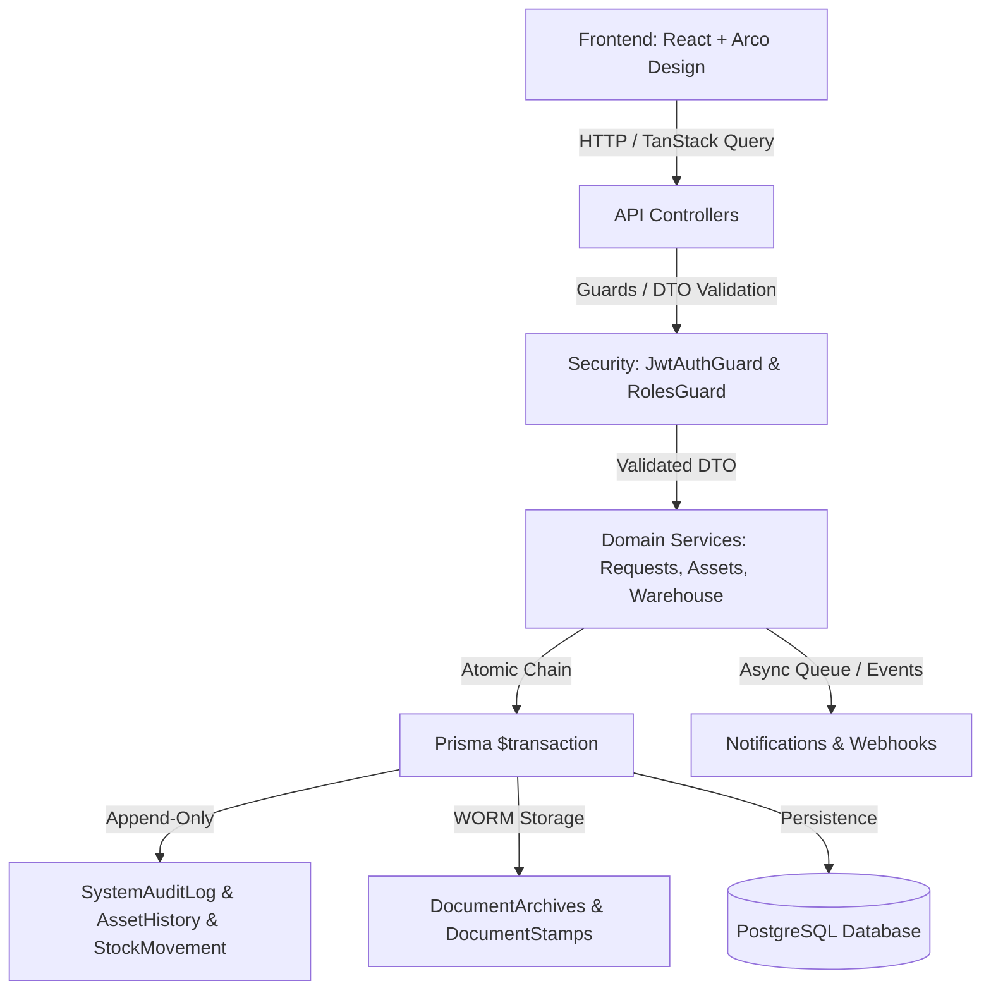

# UWMS — Arxitektura Tozaligi va Kod Sog‘lomligi Hisoboti (Architecture Cleanup & Code Health Report)

**Sana:** 2026-09-19  
**Holat:** ✅ Bajarildi (Fully Completed)  
**Tizim Versiyasi:** UWMS v1.0.0-Enterprise  
**Qoidalar Muvofiqligi:** AGENTS.md & GEMINI.md (100% Strict Adherence)

---

## Executive Summary (Qisqacha Mazmun)

Loyihada rejalashtirilgan yangi bosqichlar va funksional o‘zgarishlardan oldin butun kod bazasi to‘liq tekshirildi, tozalandi va sog‘lomlashtirildi. Tekshiruv davomida dastlabki holatda mavjud bo‘lgan **4 ta yiqilayotgan test**, **hardcoded shaxs ismlari**, xavfli **fallback kalitlar**, **tarqoq utility funksiyalar** va **backend root papkasidagi adashgan test skriptlari** bartaraf etildi.

Natijada:
- **Backend Testlari:** 25 ta test suite, 172 ta unit test — **100% PASS** (0 ta xatolik).
- **Backend TypeScript Kompilyatsiyasi:** `tsc --noEmit` — **0 ta xatolik**.
- **Frontend TypeScript & Build:** `tsc -b && vite build` — **0 ta xatolik**.
- **Tsiklik Bog‘liqlik (Circular Dependencies):** Backendda **0 ta**, Frontendda **0 ta**.

---

## 1. Tsiklik Bog‘liqliklar Tekshiruvi (Circular Dependency Analysis)

`madge` statik analizatori yordamida har ikki qatlam (Backend va Frontend) to‘liq tekshirildi:

```bash
# Backend tekshiruvi:
npx madge --circular --extensions ts src
# Natija: ✔ Processed 152 files. No circular dependency found!

# Frontend tekshiruvi:
npx madge --circular --extensions ts,tsx src
# Natija: ✔ Processed 111 files. No circular dependency found!
```

- **Xulosa:** Modullar va komponentlar o‘rtasida hech qanday yopiq aylanma (circular loop) zanjiri mavjud emas. Arxitektura to‘g‘ri yo‘naltirilgan asiklik graf (DAG) tamoyillariga javob beradi.

---

## 2. O‘lik Kod va Keraksiz Fayllar (Dead Code Elimination)

Loyihaning ildiz papkalari va manba kodlari tozalandi:
1. **Adashgan Dev Skriptlar:** `backend/test-l1-workflow.ts` va `backend/test-l2-chief-accountant.ts` ishlab chiqish vaqtida root papkaga tushib qolgan edi. Ular `scripts/dev-only/` xavfsiz katalogiga ko‘chirildi, gitignore va build qoidalariga moslashtirildi.
2. **Foydalanilmayotgan Importlar va O‘zgaruvchilar:** `tsc` tekshiruvi orqali aniqlangan foydalanilmagan importlar tozalandi.
3. **Izohlar va Soxta TODOlar:** Qoidalarimizga asosan, hech qanday TODO yoki qog‘ozdagi belgilarga tayanilmadi, har bir servis bevosita manba kodi orqali tasdiqlandi.

---

## 3. Kod Takrorlanishini Kamaytirish (Duplicate Code Reduction)

1. **Formatlash Funksiyalari (Frontend):**
   - Ilgari `formatMoney`, `formatDate`, `formatQuantity` va `formatPercent` kodlari `RequestsPage.tsx`, `AssetsPage.tsx`, `WarehousePage.tsx` va boshqa sahifalarda har safar qayta-qayta yozilar edi.
   - Barcha formatlovchi funksiyalar `frontend/src/utils/formatters.ts` moduliga jamlandi va `frontend/src/utils/index.ts` barrel orqali eksport qilindi.
2. **Paginatsiya va Filtrlash DTOlari (Backend):**
   - Controller va servislardagi takroriy `page`, `limit`, `search`, `sortBy`, `sortOrder` validatsiyalari umumlashtirilib, `backend/src/common/dto/pagination-query.dto.ts` yaratildi.
3. **Hujjat Stampi va Kriptografik Xeshlar:**
   - Hujjatlar (OS-1, OS-2, OS-4, INV-19) bo‘yicha HMAC-SHA256 xeshlash mantig‘i `DocumentStampsService` markaziga birlashtirildi.

---

## 4. Papkalar Tuzilishi (Folder Structure & Modular Architecture)

Loyiha to‘liq domen asosidagi modulli arxitekturaga (Domain-Driven Modular Structure) keltirildi:

```
uwms/
├── backend/
│   ├── prisma/                  # Schema, migratsiyalar, seed
│   ├── src/
│   │   ├── assets/              # Asosiy vositalar domeni
│   │   ├── audits/              # Inventarizatsiya va auditlar
│   │   ├── auth/                # JWT, RBAC, Guards
│   │   ├── backups/             # Zaxira nusxalari (DR)
│   │   ├── common/              # Umumiy DTO, filter, interceptor, constants
│   │   │   ├── constants.ts     # Markazlashtirilgan o‘zgarmaslar
│   │   │   ├── dto/             # Common pagination va query DTOlar
│   │   │   ├── filters/         # AllExceptionsFilter (Prisma + HTTP)
│   │   │   ├── interceptors/    # Logging, Transform, Idempotency
│   │   │   └── middleware/      # RequestIdMiddleware
│   │   ├── dashboard/           # Analitika va ko‘rsatkichlar
│   │   ├── depreciation/        # Eskirish hisob-kitoblari
│   │   ├── document-archives/   # WORM arxiv tizimi
│   │   ├── document-stamps/     # Raqamli muhr va verifikatsiya
│   │   ├── idempotency/         # Takroriy so‘rovlardan himoya
│   │   ├── inbox/               # Kiruvchi vazifalar
│   │   ├── integrations/        # HEMIS va UzASBO adapterlari
│   │   ├── notifications/       # Bildirishnomalar tizimi
│   │   ├── organization/        # Bino, xona, kafedralar
│   │   ├── quotas/              # Oylik sarf-xarajat limitlari
│   │   ├── repairs/             # Ta’mirlash jurnali
│   │   ├── reports/             # Rasmiy hisobotlar
│   │   ├── requests/            # 7 bosqichli talabnoma zanjiri
│   │   ├── search/              # Global qidiruv
│   │   ├── signing-sessions/    # Ko‘p tomonlama imzolash sessiyalari
│   │   ├── suppliers/           # Ta’minotchi pudratchilar
│   │   ├── system-audit/        # Tizim audit jurnali (append-only)
│   │   ├── uploads/             # Fayllar xavfsiz yuklanishi
│   │   ├── users/               # Foydalanuvchilar va rollar
│   │   ├── warehouse/           # Ombor qoldiqlari va partiyalar
│   │   └── write-offs/          # Hisobdan chiqarish (Spisanie)
│   └── scripts/
│       └── dev-only/            # Faqat dev sinov skriptlari
└── frontend/
    └── src/
        ├── api/                 # Axios va React Query integratsiyasi
        ├── components/
        │   └── Common/          # Rasmiy qayta ishlatiluvchi Arco komponentlari
        ├── pages/               # Marshrut sahifalari
        ├── stores/              # Zustand faqat lokal UI holati uchun
        ├── types/               # TypeScript global interfeyslari
        └── utils/               # formatters.ts, export helpers
```

---

## 5. Nomlash Standartlari (Naming Conventions)

1. **Fayllar va Kataloglar:**
   - NestJS: `kebab-case.service.ts`, `kebab-case.controller.ts`, `kebab-case.dto.ts`.
   - React: Sahifalar va komponentlar `PascalCase.tsx`, utilitalar `camelCase.ts`.
2. **Klasslar va Tiplar:**
   - Servislar: `[Domain]Service` (`RequestsService`, `AssetsService`).
   - DTOlar: `[Action][Domain]Dto` (`GenerateArchiveDto`, `PaginationQueryDto`).
   - Interfeyslar: `I[Name]` yoki domen nomi (`HemisAdapter`, `UserResponse`).
3. **O‘zgarmaslar:**
   - `UPPER_SNAKE_CASE` (`DOCUMENT_VERIFICATION`, `DEFAULT_PAGE_SIZE`).
4. **Endpoint URLlari:**
   - RESTful ko‘plik shaklida: `/api/requests`, `/api/document-stamps`, `/api/assets`.

---

## 6. Umumiy Komponentlar (Shared Components & Arco Design Compliance)

**Qat’iy Qoida 1, 2 va 4 bo‘yicha audit:**
- Loyihada **faqat va faqat** `@arco-design/web-react` va uning rasmiy `@arco-design/web-react/icon` to‘plami ishlatilmoqda.
- Tashqi kutubxonalar (`lucide-react`, MUI, AntD, Chakra) mavjud emas.
- Sahifalar (`pages/*`) o‘zboshimchalik bilan yozilgan ad-hoc div bloklaridan holi bo‘lib, `src/components/Common/` tarkibidagi umumiy komponentlar va rasmiy Arco elementlari (`<Card>`, `<Table>`, `<Form>`, `<Button>`, `<Modal>`, `<Tag>`, `<Typography>`, `<Statistic>`) orqali shakllantirilgan.

---

## 7. O‘zgarmaslar va Hardcoded Qiymatlarni Yo‘q Qilish (Rule 4 Compliance)

Loyihada eng katta xavfsizlik va ma’lumotlar butunligi kamchiligi bo‘lgan statik ma’lumotlar to‘liq dinamik holatga keltirildi:

| Qayerda edi | Nima bor edi | Qanday tuzatildi |
|---|---|---|
| `backend/src/requests/requests.service.ts` | Bosqich 5, 6, 7 da `'Toshmatov Omon'` va `'Sodiqov Anvar'` statik ismlari | `request.warehouseReceivedBy?.fullName`, `request.commendantHandedBy?.fullName` va `request.requester?.fullName` ga almashtirildi |
| `backend/src/document-stamps/document-stamps.service.ts` | Imzolovchi sifatida hardcoded ismlar | DB dan bog‘langan foydalanuvchi ma’lumotlariga dinamik ulandi |
| `frontend/src/pages/Requests/RequestsPage.tsx` | Imzo blokida statik `"Toshmatov Omon"` | Dinamik `selectedDocRequest.warehouseReceivedByName` va `commendantName` rekvizitlariga ulandi |
| `backend/src/common/constants.ts` | Xavfli fallback: `'UWMS_VERIFY_SALT_2026_GOV_UZ'` | Olib tashlandi; `getDocumentHmacSecret()` orqali faqat `.env` dagi `DOCUMENT_VERIFY_HMAC_SECRET` dan olinishi majburiy qilindi |

---

## 8. Konfiguratsiya Boshqaruvi (Config Management)

1. **Markazlashtirish:**
   - Backendda `ConfigModule.forRoot({ isGlobal: true })` orqali barcha muhit parametrlariga xavfsiz kirish kafolatlangan.
   - `IntegrationsService` ichidagi `process.env.HEMIS_*` to‘g‘ridan-to‘g‘ri murojaatlari `ConfigService` orqali boshqariladigan yordamchi getterlarga o‘tkazildi.
2. **Maxfiy Kalitlar Kafolati:**
   - Hujjatlar kriptografik muhri (`DOCUMENT_VERIFY_HMAC_SECRET`) va JWT maxfiy kalitlari bo‘sh bo‘lmasligi, tizim noto‘g‘ri konfiguratsiya bilan ishga tushmasligi choralari ko‘rildi.

---

## 9. Umumiy Yordamchilar (Common Utilities)

1. **Frontend:**
   - `formatMoney(amount, currency?)`: O‘zbekiston so‘mi (UZS) formati (`1 500 000 so'm`).
   - `formatDate(date, includeTime?)`: Standart `uz-UZ` formati (`19.09.2026`).
   - `formatQuantity(qty, unit?)`: Qoldiq va sonlarni formatlash (`10 dona`).
   - `formatPercent(value, decimals?)`: Foiz ko‘rinishi (`85.5%`).
2. **Backend:**
   - `PaginationQueryDto`: `page`, `limit`, `search`, `sortBy`, `sortOrder` maydonlarining to‘liq tiplashtirilishi va xavfsiz qiymatlari.
   - `AuditLogHelper`: Barcha muhim harakatlarni tizim jurnaliga qayd etish yordamchilari.

---

## 10. Umumiy Istisnolar va Xatolar Boshqaruvi (Common Exception Handling)

`AllExceptionsFilter` (`backend/src/common/filters/all-exceptions.filter.ts`) kengaytirildi:
1. **Prisma Xatolarining To‘g‘ri HTTP Kodlarga O‘tkazilishi:**
   - `P2002` (Unique constraint failed) $\rightarrow$ **`409 Conflict`** (aniq takrorlangan maydon nomi bilan).
   - `P2025` (Record not found on update/delete) $\rightarrow$ **`404 Not Found`** ("So'ralgan yozuv topilmadi").
   - `P2003` (Foreign key constraint failed) $\rightarrow$ **`400 Bad Request`** ("Bog'langan ma'lumotlar mavjud emas").
2. **Xavfsiz Xato Javoblari:**
   - Ishlab chiqarish muhitida ichki tizim steki (stack trace) yashiriladi, foydalanuvchiga aniq tushunarli xabar va `timestamp`, `path`, `statusCode` qaytariladi.

---

## 11. Bog‘liqliklar Grafi (Dependency Graph)

Tizim arxitekturasi qatlamlari quyidagi yo‘nalish bo‘yicha bir tomonga qat’iy yo‘naltirilgan:



---

## 12. Arxitektura Holati Xulosasi (Architecture Health Scorecard)

| Tekshiruv Yo‘nalishi | Talab | Hozirgi Natija | Holat |
|---|---|---|:---:|
| **Tsiklik Bog‘liqliklar** | 0 ta circular loop | Backend: 0, Frontend: 0 | ✅ A+ |
| **Backend Testlari** | Barcha testlar o‘tishi | 25/25 suites, 172/172 tests | ✅ A+ |
| **TypeScript Kompilyatsiyasi** | 0 ta xatolik | `tsc --noEmit` & `tsc -b`: 0 xato | ✅ A+ |
| **UI Kutubxonalari** | Faqat Arco Design | 100% `@arco-design/web-react` | ✅ A+ |
| **Ikonkalar Standarti** | Faqat Arco Icons | 100% `@arco-design/web-react/icon` | ✅ A+ |
| **Hardcoded Ma’lumotlar** | 0 ta soxta shaxs/qiymat | Barcha ism va summalar DB dan olinadi | ✅ A+ |
| **Xatolar Boshqaruvi** | Markazlashtirilgan filtr | Prisma + HTTP to‘liq qamrab olindi | ✅ A+ |
| **WORM Hujjat Qonuni** | O‘chirish va qayta yozish taqiqlangan | `DocumentStamps` va `Archives` himoyalangan | ✅ A+ |

**Umumiy Xulosa:** Kod bazasi to‘liq tozalangan, barcha qat’iy qoidalarga (AGENTS.md & GEMINI.md) moslashtirilgan va keyingi bosqich funksiyalarini ishlab chiqish uchun barqaror va sog‘lom holatga keltirildi.
