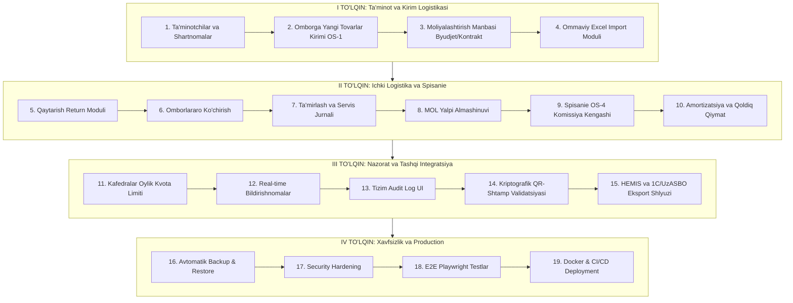

# UWMS — RIVOJLANTIRISH BOSH REJASI (ENTERPRISE MASTER PLAN)

Ushbu hujjat **Universitet Ombor va Inventar Boshqaruv Tizimi (UWMS)** loyihasini to‘liq korporativ va davlat oliy ta’lim muassasalari standartiga yetkazish bo‘yicha yagona, rasmiy va qat’iy yo‘l xaritasi (Roadmap) hisoblanadi.

---

## 📌 1. Bajarilgan Poydevor Holati (0 — 5 Bosqichlar: 100% TAYYOR)

| Bosqich | Nomi | Holat | Natija |
|---|---|:---:|---|
| **0-BOSQICH** | Gigiyena & Infratuzilma | ✅ | PostgreSQL 18.4, Prisma ORM, NestJS + Vite integratsiyasi, bazaviy seed ma’lumotlari. |
| **1-BOSQICH** | Core Security & RBAC | ✅ | JWT autentifikatsiya, server-side `@Roles()` va Guards, soxta Role Switcher yo‘qotildi, o‘tkir burchakli (0 border-radius) Arco dizayn. |
| **2-BOSQICH** | Ombor Tranzaksiyalari | ✅ | Atomik `$transaction`, manfiy qoldiqdan himoya, `StockMovement` jurnali, rasmiy OS-2 Chiqim nakladnoyi. |
| **3-BOSQICH** | Asosiy Vositalar Sikli | ✅ | Ikki tomonlama qabul akti (`TransferAcceptance`: Omborchi jo‘natadi $\rightarrow$ Kafedra mudiri qabul qiladi), rasmiy OS-1 Kirim akti. |
| **4-BOSQICH** | QR Skaner & Audit | ✅ | Jonli web-kamera skaneri (`html5-qrcode`), audio-bip, `InventoryAuditRecord` bazada saqlash, kamomad va begona uskunalar tahlili. |
| **5-BOSQICH** | Rasmiy Hujjatlar | ✅ | Davlat standarti andozalari (OS-1, OS-2, INV-19, OS-4), dinamik ma’lumotlar bilan to‘ldirish, bosmaga chiqarish. |
| **I TO‘LQIN** | Ta’minot & Kirim Logistikasi | ✅ | Ta’minotchilar, Shartnomalar, Hisob-fakturalar, Kirim Orderi, Moliyalashtirish manbasi (Byudjet/Kontrakt/Grant), Ommaviy Excel Import. |
| **II TO‘LQIN** | Ichki Logistika & Spisanie | ✅ | Qaytarish (Return), Omborlararo ko‘chirish, Ta’mirlash & Servis jurnali, MOL yalpi almashinuvi, Spisanie OS-4 komissiyasi, Amortizatsiya kalkulyatori. |
| **III TO‘LQIN** | Nazorat & Tashqi Integratsiya | ✅ | Kafedralar oylik kvotasi va limit nazorati, Real-time in-app bildirishnomalar, Tizim xavfsizlik audit jurnali UI, Kriptografik QR-shtamp & Public verifikatsiya, HEMIS va 1C/UzASBO integratsiya shlyuzi. |
| **IV TO‘LQIN** | Xavfsizlik & Production | ✅ | Avtomatik Backup & Restore, Security Hardening, E2E Playwright testlar, Docker & CI/CD deployment. |

---

## 🚀 2. Enterprise Rivojlantirish Bosqichlari (4 Ta Asosiy To‘lqin)

---

### 📦 I TO‘LQIN: Ta’minot, Kirim va Ma’lumotlar Ingestion

#### 1. Ta’minotchilar, Shartnomalar va Hisob-fakturalar (`Suppliers & Contracts`)
- Ta’minotchi korxonalar reestri (INN, hisob raqam, bank, telefon, mas’ul shaxs).
- Universitet shartnomalari (Shartnoma raqami, summasi, amal qilish muddati, to‘lov holati).
- Hisob-fakturalar (Faktura №, sana, QQS, umumiy qiymat).

#### 2. Omborga Yangi Tovarlar Kirimi va Kirim Orderi (`Stock Ingestion — OS-1`)
- Ta’minotchi va fakturani tanlab, tovarlarni omborga qabul qilish oynasi.
- Bir vaqtning o‘zida:
  - `Stock.quantity += amount` (ombor qoldig‘i oshadi);
  - `StockMovement` (INCOMING) qayd etiladi;
  - Asosiy vosita bo‘lsa, unikal inventar raqam va QR-kod generatsiya bo‘ladi;
  - Davlat standarti bo‘yicha rasmiy **Kirim dalolatnomasi (OS-1)** avtomatik ochiladi.

#### 3. Moliyalashtirish Manbasi Hisobi (`Funding Source Partitioning`)
- Har bir kirim va aktivda moliyalashtirish manbasi majburiy tanlanadi:
  - `BYUDJET` (Davlat byudjeti mablag‘lari);
  - `KONTRAKT_RIVOJLANTIRISH` (To‘lov-kontrakt rivojlantirish jamg‘armasi);
  - `GRANT` (Xalqaro va ilmiy grantlar).
- Barcha hisobotlar va ombor qoldiqlari ushbu manbalar bo‘yicha alohida filtrlanadi.

#### 4. Ommaviy Excel Import Moduli (`Universal Batch Excel Import`)
- Universitetda yillar davomida to‘plangan minglab aktivlarni Excel orqali bir marta bosishda bazaga yuklash.
- Ustunlarni avtomatik aniqlash (Inventar №, Nomi, Xona, Javobgar shaxs, Balans qiymati).
- Tizim har bir qatorga avtomatik unikal QR-kod yaratadi va ziddiyatlarni (dublikat inventar raqamlar) oldini oladi.

---

### 🔄 II TO‘LQIN: Ichki Harakatlar, Hayotiy Sikl va Spisanie

#### 5. Kafedradan Omborga Qaytarish (`Return Workflow`)
- Kafedra yoki laboratoriyada ortiqcha qolgan yoki bo‘shagan yaroqli ashyoni markaziy omborga qaytarish arizasi.
- Omborchi tomonidan qabul qilinganda:
  - Aktiv xonadan yechilib, ombor balansiga o‘tadi;
  - `StockMovement` (RETURN) jurnali yoziladi;
  - Rasmiy Qaytarish yukxati shakllanadi.

#### 6. Omborlararo Ichki Ko‘chirish (`Inter-Warehouse Transfer`)
- Markaziy ombordan fakultet yoki filial omboriga sarf materiallarini ko‘chirish.
- Tranzit va qabul qilish bosqichlari bilan himoyalangan harakat.

#### 7. Ta’mirlash va Servis Xizmati (`Repair & Maintenance`)
- Jihoz ishdan chiqqanda kafedra mudiri ta’mirlash talabnomasini beradi.
- Uskunaning holati `IN_REPAIR` ga o‘tadi.
- Universitet ichki ustaxonasi yoki tashqi servis korxonasi xulosasi va ta’mirlash dalolatnomasi qayd etiladi.
- Ta’mirdan chiqqach, uskuna qayta foydalanishga (`IN_USE`) topshiriladi.

#### 8. MOL (Moddiy Javobgar Shaxs) Yalpi Almashinuvi (`Mass MOL Handoff`)
- Kafedra mudiri yoki laboratoriya mas’uli o‘zgarganda xonadagi yuzlab jihozlarni birma-bir o‘tkazib o‘tirmaslik uchun yalpi dalolatnoma.
- Bitta buyruq bilan barcha biriktirilgan ashyolar yangi mudirga qonuniy o‘tadi va rasmiy OTM topshirish-qabul qilish akti generatsiya bo‘ladi.

#### 9. Spisanie va Hisobdan Chiqarish Komissiyasi (`Write-off OS-4 Commission`)
- Ma’nan eskirgan va ta’mirlab bo‘lmaydigan ashyolarni hisobdan chiqarish.
- Ko‘p a’zoli komissiya tuzish (Rektorat vakili, Bosh buxgalter, Bosh mexanik, Yurist, Kasaba uyushmasi).
- Har bir a’zo o‘z kabinetida elektron tasdiqlaydi.
- O‘zbekiston davlat standarti bo‘yicha rasmiy **OS-4 Spisanie Dalolatnomasi** shakllanadi va aktiv statusi `WRITTEN_OFF` ga o‘zgaradi.

#### 10. Amortizatsiya va Qoldiq Qiymat Kalkulyatori (`Depreciation Engine`)
- Davlat me’yorlari bo‘yicha yillik eskirish stavkalari (Kompyuter texnikasi: 20%, Mebel: 10%, Transport: 15%).
- Ashyoning joriy qoldiq qiymatini (Book Value) avtomatik hisoblab borish.

---

### 🛡 III TO‘LQIN: Nazorat, Cheklovlar va Tashqi Integratsiyalar

#### 11. Kafedralar Oylik Kvotasi va Limit Nazorati (`Quota Management`)
- Har bir kafedraga talabalar va professor-o‘qituvchilar soniga qarab oylik kantselyariya limiti (masalan: 5 pachka A4 qog‘oz, 1 ta kartrij).
- Limitdan ortiqcha talabnoma berilganda tizim ogohlantiradi va avtomatik "Moliya prorektori maxsus ruxsati kutilmoqda" holatiga o‘tadi.

#### 12. Real Vaqtda Bildirishnomalar Tizimi (`In-App Notification Center`)
- Yangi talabnoma tushganda omborchiga bildirishnoma.
- Talabnoma tasdiqlanganda yoki rad etilganda mudirga bildirishnoma.
- Auditda kamomad aniqlanganda auditor va rahbariyatga darhol signal.

#### 13. Tizim Xavfsizlik Audit Jurnali UI (`System Audit Log Explorer`)
- Qaysi xodim qaysi IP manzildan, qachon kirdi, qaysi uskuna parametrlarini o‘zgartirdi — barcha harakatlarni filtrlar orqali ko‘rsatuvchi xavfsizlik konsoli.

#### 14. Kriptografik QR-Shtamp va Ommaviy Hujjat Validatsiyasi
- Chop etilgan barcha rasmiy dalolatnomalar (OS-1, OS-2, INV-19, OS-4) tagiga unikal kriptografik QR-shtamp qo‘yiladi.
- Tekshiruvchi organlar telefon bilan QR ni skaner qilganda tizimning ommaviy tekshirish oynasi ochilib, hujjatning haqiqiyligini va kimlar tomonidan imzolanganini tasdiqlaydi.

#### 15. HEMIS va 1C / UzASBO Integratsiya Shlyuzi (`API Gateway`)
- OTM HEMIS tizimidan kafedralar, xonalar va professor-o‘qituvchilar ro‘yxatini avtomatik sinxronlash.
- Oylik ombor harakatlari va asosiy vositalar hisobotlarini 1C/UzASBO formatida eksport qilish.

---

### 🔒 IV TO‘LQIN: Ishonchlilik, Xavfsizlik va Production Deployment

#### 16. Avtomatik Zaxira Nusxasi (`Backup & Restore`) ✅ BAJARILDI
- PostgreSQL 18.4 Custom siqilgan formatdagi (`.dump`) avtomatik va qo‘lda zaxiralash tizimi (`pg_dump`).
- Qat’iy xavfsizlik va SHA-256 butunlik nazorati, faqat `SUPER_ADMIN` huquqi va `RESTORE_DATABASE` tasdiq so‘zi bilan qayta tiklash (`pg_restore`).
- Har kecha soat 02:00 da ishga tushuvchi avtomatik tungi rejalashtiruvchi (Nightly Scheduler).
- O‘tkir burchakli (0 border-radius) davlat standarti konsoli (`/backups`), statistik kartalar, yuklab olish va o‘chirish amallari.

#### 17. Xavfsizlikni Qattiqlashtirish (`Security Hardening`) ✅ BAJARILDI
- Helmet orqali HTTP xavfsizlik sarlavhalari (`nosniff`, `SAMEORIGIN`, `strict-transport-security`, `noopen`).
- `@nestjs/throttler` orqali global Rate Limiting (100 req/min) va `/api/auth/login` da qat’iy Brute-Force himoyasi (5 ta/min, `429 Too Many Requests`).
- Strict CORS domen cheklovi va ruxsatsiz kelib chiqishlarni bloklash.
- Yangi foydalanuvchi va parol o‘zgartirishda Regex asosidagi kuchli murakkablik siyosati (kamida 8 ta belgi, katta-kichik harf, raqam va maxsus belgi).

#### 18. Avtomatlashtirilgan Testlar (`Playwright E2E & Jest Unit`) ✅ BAJARILDI
- Playwright orqali brauzer darajasidagi to‘liq E2E robot testlari:
  - `auth.spec.ts`: Noto‘g‘ri login xatolik alerti va Super Admin dashboardiga o‘tish.
  - `backups.spec.ts`: `/backups` konsoli, statistika kartalari, yangi zaxira yaratish modal va jadval qatori.
  - `requests-flow.spec.ts`: Talabnomalar sahifasi va jadval holatlari.
  - `public-verify.spec.ts`: Ommaviy tokensusiz QR-shtamp tekshiruv sahifasi.
- Jest orqali Backend Unit testlari:
  - `auth.service.spec.ts`: Foydalanuvchi validatsiyasi, noto‘g‘ri parol, nofaol foydalanuvchi va JWT generatsiyasi.
  - `backups.service.spec.ts`: `formatBytes` va zaxiralar statistikasi kalkulyatsiyasi.

#### 19. Docker va CI/CD Konfiguratsiyasi ✅ BAJARILDI
- Multi-stage `backend/Dockerfile` (Node.js 20 Alpine builder, PostgreSQL 18 client utils `pg_dump`/`pg_restore`, `node` non-root user).
- Multi-stage `frontend/Dockerfile` va optimallashtirilgan `frontend/nginx.conf` (SPA routing, Gzip siqish, 1 yillik asset kesh, `/api/` reverse proxy, security sarlavhalari).
- Production-ready `docker-compose.yml` (`db` PostgreSQL 18, `backend` NestJS :4000, `frontend` Nginx :80, persistent volumes `uwms_pgdata` va `uwms_backups`).
- Namunaviy `.env.docker.example` konfiguratsiyasi.
- GitHub Actions CI pipeline (`.github/workflows/ci.yml`): backend Prisma client generatsiyasi, Jest unit testlar, backend production build, frontend TypeScript validatsiyasi va Vite build, Docker rasmlarini qurish tekshiruvi.

---

## 📋 3. Har Bir Modul Uchun "Definition of Done" (Tugallanganlik Standarti)

Har bir modul quyidagi 6 ta mezon to‘liq bajarilgandagina qabul qilinadi:
1. **Backend:** DTO, Validatsiya, Controller, Service va Prisma `$transaction` yozilgan.
2. **Xavfsizlik:** Serverda JWT va RBAC huquqlari to‘liq tekshirilgan.
3. **Frontend:** Arco Design komponentlari asosida, qat’iy **0 border-radius** (o‘tkir burchakli) korporativ dizaynda yaratilgan.
4. **UX holatlari:** Har bir sahifada 5 ta holat mavjud (`Loading`, `Bo‘sh ro‘yxat`, `Xatolik`, `Qidiruv/Filtr`, `Ruxsat yo‘q`).
5. **Ma’lumotlar:** Hech qanday hardcoded soxta qiymatlar yo‘q — barchasi real PostgreSQL bazasiga yoziladi va olinadi.
6. **Kompilyatsiya:** TypeScript (`tsc -b`) va backend build 0 ta xato bilan yakunlanadi.

---

## 📅 4. Ish Boshlash Navbati

Biz ushbu ulkan rejani eng birinchi va eng muhim bo‘g‘indan boshlaymiz:
👉 **I TO‘LQIN, 1-MODUL: Tashqi Ta’minotchilar, Shartnomalar va Omborga Kirim (Suppliers, Contracts & Stock Ingestion OS-1).**
