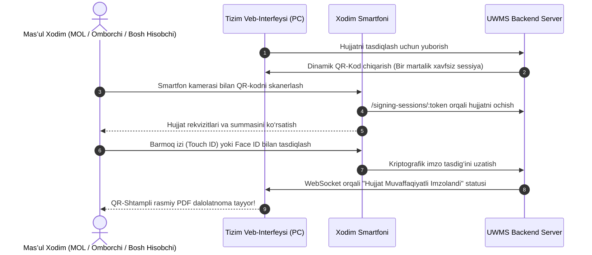

# 🚀 UWMS — Rollar Bo‘yicha Tezkor Boshlash Qo‘llanmasi (Quick Start Guide)

> **UWMS (University Warehouse Management System)** — Universitet aktivlari, moddiy-texnik bazasi, ombor qoldiqlari va inventarizatsiya jarayonlarini to‘liq raqamlashtiruvchi boshqaruv tizimi.

Ushbu yo‘riqnoma universitetning 9 ta roli vakillari uchun tizimdan tezkor, xatosiz va samarali foydalanish maqsadida ishlab chiqilgan.

---

## 📌 Rollar Bo‘yicha Tezkor Mundarija

| № | Rol Nomi | Tizimdagi Koding | Asosiy Vazifasi | Boshlang‘ich Sahifa |
|---|---|---|---|---|
| 1 | **Xodim / O‘qituvchi** | `EMPLOYEE` | Yangi buyum yoki sarf materiali uchun zayavka berish | `/requests` |
| 2 | **Moddiy Javobgar Shaxs (MOL)** | `MOL` | Kafedra mulklarini qabul qilish, saqlash va topshirish | `/assets`, `/inbox` |
| 3 | **Bosh Omborchi** | `HEAD_WAREHOUSE` | Tovarlar kirimi, qoldiqlar, sarf materiallarini tarqatish | `/warehouse`, `/suppliers` |
| 4 | **Bino Komendanti** | `COMMENDANT` | Xonalarni ko‘zdan kechirish, yangi mulklarni xonaga joylash | `/organization`, `/requests` |
| 5 | **Moliya Prorektori** | `VICE_RECTOR_FINANCE` | 50 mln so‘mgacha bo‘lgan talabnomalarni tasdiqlash | `/requests`, `/reports/funding` |
| 6 | **Universitet Rektori** | `RECTOR` | Yirik talabnomalarni va hisobdan chiqarishlarni tasdiqlash | `/requests`, `/dashboard` |
| 7 | **Bosh Hisobchi** | `CHIEF_ACCOUNTANT` | Balans, aylanma vedomost, amortizatsiya va moliya | `/reports/chief-accountant` |
| 8 | **Ichki Nazorat Auditori** | `AUDITOR` | Smartfon orqali xonama-xona QR inventarizatsiya | `/audit` |
| 9 | **Tizim Administratori** | `SUPER_ADMIN` | Foydalanuvchilar, audit jurnali, zaxira serveri | `/users`, `/backups` |

---

## 👨‍🏫 1. Xodim / O‘qituvchi (`EMPLOYEE`)

### 🎯 Vazifangiz:
Dars jarayoni yoki xizmat faoliyati uchun zarur bo‘lgan jihozlar (noutbuk, proyektor, kanselyariya tovarlari, qog‘oz va h.k.) uchun talabnoma (zayavka) yaratish va uning bajarilishini kuzatish.

### 📋 Bosqichma-bosqich harakatlar:

#### 1-qadam: Tizimga kirish va Talabnomalar sahifasi
1. Brauzerda tizim manziliga kiring: `http://localhost:5173/login` (yoki universitet ichki domeni).
2. Loginingiz va parolingizni kiriting.
3. Chap menyudan **"Talabnomalar"** (`/requests`) bo‘limiga o‘ting.

#### 2-qadam: Yangi Talabnoma kiritish
1. Sahifaning yuqori o‘ng burchagidagi **"+ Yangi Talabnoma"** tugmasini bosing.
2. Ochilgan modal oynada quyidagi maydonlarni to‘ldiring:
   - **Turi:** `FIXED_ASSET` (Asosiy vosita - kompyuter, mebel) yoki `CONSUMABLE` (Sarf materiali - qog‘oz, toner).
   - **Mulk / Mahsulot nomi:** Kerakli jihoz nomini aniq yozing (Masalan: `A4 Qog‘oz svetocopy` yoki `Laboratoriya uchun Monitor 24"`).
   - **Miqdori:** Talab qilinayotgan soni (Masalan: `5`).
   - **O‘lchov birligi:** `dona`, `quti`, `komplekt`.
   - **Qaysi xona uchun:** O‘zingiz faoliyat yuritadigan xonani tanlang (Masalan: `304-xona`).
   - **Kafedra / Bo‘lim:** Kafedrangizni tanlang.
   - **Asoslash (Sabab):** Nega kerakligi haqida qisqacha izoh (Masalan: `1-kurs talabalarining amaliy mashg‘ulotlari uchun`).
3. **"Yuborish"** tugmasini bosing.

#### 3-qadam: Holatni kuzatish
- Talabnomangiz ro‘yxatda paydo bo‘ladi.
- Rangli status belgilari orqali zayavka kimda turganini ko‘rishingiz mumkin:
  - `Yuborildi` $\rightarrow$ `Moliya Tasdiqladi` $\rightarrow$ `Omborga Yetib Keldi` $\rightarrow$ `Komendantga Berildi` $\rightarrow$ `Topshirildi (Bajarildi)`.

---

## 🏛 2. Moddiy Javobgar Shaxs (`MOL`)

### 🎯 Vazifangiz:
Kafedra yoki laboratoriyangiz hisobidagi barcha kompyuterlar, mebellar va qimmatbaho ashyolarni qabul qilish, inventar ro‘yxatini nazorat qilish, xodimlar o‘rtasida ichki harakatlantirish va ishdan bo‘shash/almashishda **MOL Topshirish Dalolatnomasi (OS-1 / Handover)** orqali mas’uliyatni topshirish.

### 📋 Bosqichma-bosqich harakatlar:

#### 1-qadam: O‘z hisobingizdagi aktivlarni ko‘rish
1. Chap menyudan **"Aktivlar"** (`/assets`) sahifasiga kiring.
2. Jadvalda faqat sizning zimmangizga biriktirilgan asosiy vositalar ro‘yxati (Inventar raqami, Nomi, Xonasi, Holati, Balans narxi) ko‘rinadi.

#### 2-qadam: Yangi mulkni qabul qilib olish va Raqamli Imzolash
1. Omborchi sizning kafedrangizga yangi jihoz chiqarganda, tizimning **"Kiruvchi Xabarlar"** (`/inbox`) bo‘limiga xabarnoma keladi.
2. Xabarnomani ochib, **"OS-1 Qabul Qilish-Topshirish Dalolatnomasi"**ni ko‘rib chiqing.
3. Ekranda **Dinamik QR-Kod** paydo bo‘ladi:
   - Smartfoningiz kamerasi orqali QR-kodni skanerlang.
   - Mobil ekranda dalolatnoma rekvizitlarini tekshirib, **"Biometrik Imzolash"** (Touch ID / Face ID) tugmasini bosing.
   - Hujjat bir necha soniyada O‘zbekiston davlat oliy ta’lim standarti bo‘yicha QR-shtamp bilan muhrlanadi.

#### 3-qadam: Mas’uliyatni yangi MOL xodimiga topshirish (Handover jarayoni)
1. Agar lavozimingiz o‘zgarsa yoki mehnat ta’tiliga chiqsangiz:
2. `/inbox` sahifasida **"MOL Mas’uliyatini Topshirish"** tugmasini bosing.
3. Yangi mas’ul xodimni (qabul qiluvchini) va asoslovchi buyruq raqamini kiriting.
4. Tizim sizning zimmangizdagi barcha mulklarni biriktirilgan holda yagona yalpi dalolatnoma shakllantiradi.
5. Yangi xodim va komissiya a’zolari imzolagach, mulklar avtomatik tarzda uning hisobiga o‘tadi.

---

## 📦 3. Bosh Omborchi (`HEAD_WAREHOUSE`)

### 🎯 Vazifangiz:
Yetkazib beruvchilardan tovarlarni qabul qilish (Kirim / Ingest), ombor qoldiqlarini boshqarish, sarflanuvchi materiallarni kafedralarga limit (kvota) asosida berish va har bir aktivga QR-stiker chop etish.

### 📋 Bosqichma-bosqich harakatlar:

#### 1-qadam: Tovarlarni omborga kirim qilish (Kirim Ingest)
1. Chap menyudan **"Ombor"** (`/warehouse`) bo‘limiga o‘ting.
2. **"+ Yangi Kirim (Ingest)"** tugmasini bosing.
3. Ma’lumotlarni to‘ldiring:
   - **Yetkazib beruvchi (Ta’minotchi):** Ro‘yxatdan tanlang yoki yangi qo‘shing (`/suppliers`).
   - **Shartnoma va Hisob-faktura raqami.**
   - **Moliyalashtirish manbasi:** `BYUDJET` yoki `KONTRAKT_RIVOJLANTIRISH` yoki `GRANT`.
   - **Kirim qilinayotgan tovarlar:** Tovar nomi, miqdori, birlik narxi.
4. **"Kirimni Tasdiqlash"** tugmasini bosing. Tizim avtomatik ravishda `Stock` qoldiqlarini oshiradi va `StockMovement` jurnaliga qayd etadi.

#### 2-qadam: Aktivlarga QR-Stiker chiqarish
1. Asosiy vosita kirim qilinganda unga unikal inventar raqam generatsiya qilinadi.
2. Aktivlar jadvalida har bir qatorda **"QR Kod"** tugmasi mavjud.
3. Tugmani bosib, mini termal printer yoki oddiy A4 qog‘ozga QR-stikerni chop eting va jihoz korpusiga yopishtiring.
   > **Muhim:** Dublikat stiker chop etilganda tizim sizdan sababini so‘raydi va audit jurnaliga yozadi.

#### 3-qadam: Talabnoma bo‘yicha tovar chiqarish
1. Tasdiqlangan talabnomalar `/requests` sahifasida `RECEIVED_AT_WAREHOUSE` holatida ko‘rinadi.
2. Kafedraning oylik kvotasi yetarli ekanligini tekshirib, **"Tovarni Chiqarish"** tugmasini bosing.
3. Ombor qoldig‘i manfiyga tushib ketmasligi server darajasida kafolatlangan.

---

## 🏢 4. Bino Komendanti (`COMMENDANT`)

### 🎯 Vazifangiz:
Universitet binolaridagi barcha auditoriyalar, laboratoriyalar va xizmat xonalarining moddiy holatini nazorat qilish. Yangi jihozlar keltirilganda xonada joy mavjudligini ko‘zdan kechirib, topshirish jarayonini tasdiqlash.

### 📋 Bosqichma-bosqich harakatlar:

#### 1-qadam: Xonalar va ulardagi jihozlarni ko‘zdan kechirish
1. Chap menyudan **"Tashkiliy Tuzilma"** (`/organization`) sahifasiga o‘ting.
2. O‘zingizga biriktirilgan binoni tanlang (Masalan: `Bosh bino` yoki `Fizika fakulteti korpusi`).
3. Auditoriyani tanlang (Masalan: `201-auditoriya`):
   - Xonadagi barcha partalar, stullar, kompyuterlar va konditsionerlar ro‘yxatini ko‘rasiz.
   - Xonaning mas’ul xodimi (MOL) kimligi aks etadi.

#### 2-qadam: Yangi jihozni xonaga biriktirish
1. Omborchi tomonidan chiqarilgan buyumlar komendantga kelib tushganda:
2. `/requests` sahifasida buyumni qabul qilib, xonaning aniq joyiga o‘rnatilgach, **"Xonaga Joylashtirildi"** tugmasini bosing.
3. Mazkur amal orqali aktivning xona koordinatasi bazada yangilanadi.

---

## 💼 5. Moliya Prorektori va Universitet Rektori (`VICE_RECTOR_FINANCE` / `RECTOR`)

### 🎯 Vazifangiz:
Universitet byudjeti va rivojlantirish jamg‘armasi mablag‘larining maqsadli sarflanishini nazorat qilish. Katta hajmdagi xarid talabnomalarini elektron ko‘rib chiqish va tasdiqlash/rad etish.

### 📋 Bosqichma-bosqich harakatlar:

#### 1-qadam: Kelib tushgan zayavkalarni ko‘rish
1. Tizimga kirishingiz bilan **"Boshqaruv Paneli"** (`/dashboard`) va **"Talabnomalar"** (`/requests`) ochiladi.
2. `Tasdiqlash Kutilmoqda` filtri orqali moliyalashtirish talab qilinayotgan barcha arizalar ko‘rinadi.

#### 2-qadam: Talabnomani tasdiqlash yoki rad etish
1. Kerakli talabnoma ustiga bosing (Ariza summasi, kafedra nomi va asoslash ko‘rinadi).
2. **50 mln so‘mgacha** bo‘lgan arizalarni **Moliya Prorektori** tasdiqlaydi.
3. **50 mln so‘mdan yuqori** yoki maxsus arizalarni **Rektor** tasdiqlaydi.
4. **"Tasdiqlash"** tugmasini bosing:
   - Agar rad etilayotgan bo‘lsa, **"Rad etish"** tugmasi bosiladi va rasmiy sabab (izoh) yozilishi shart. Ariza beruvchiga zudlik bilan bildirishnoma boradi.

#### 3-qadam: Moliyalashtirish hisobotlarini kuzatish
- `/reports/funding` sahifasida `Byudjet` va `To‘lov-kontrakt` mablag‘lari bo‘yicha aktivlar harakati, xaridlar grafigi va Excel eksport mavjud.

---

## 🧮 6. Bosh Hisobchi (`CHIEF_ACCOUNTANT`)

### 🎯 Vazifangiz:
Universitet moliyaviy hisobotlari, moddiy aylanma vedomosti, oylik eskirish (amortizatsiya) hisoblash hamda yaroqsiz ashyolarni hisobdan chiqarish (OS-4 Spisanie) komissiyasiga rahbarlik qilish.

### 📋 Bosqichma-bosqich harakatlar:

#### 1-qadam: Moddiy Aylanma Vedomostini ko‘rish
1. Chap menyudan **"Bosh Hisobchi Jurnali"** (`/reports/chief-accountant`) sahifasiga o‘ting.
2. Davrni tanlang (Oy yoki Yil):
   - Har bir MOL hisobidagi: `Boshlang‘ich qoldiq` + `Kirim` - `Chiqim` = `Oxirgi qoldiq`.
   - Excel formatida yuklab olish uchun **"Excel Eksport"** tugmasini bosing.

#### 2-qadam: Oylik Eskirish (Amortizatsiya) hisoblash
1. `/depreciation` sahifasiga o‘ting.
2. Joriy oy holati bo‘yicha **"Hisoblashni Ko‘rib Chiqish (Preview)"** tugmasini bosing.
3. Tizim to‘g‘ri chiziqli (linear) usulda 1 oylik eskirish summasini hisoblab beradi.
4. **"Amortizatsiyani Yuritish"** tugmasini bossangiz, buxgalteriya provodkalari avtomatik shakllanadi.

#### 3-qadam: Asosiy vositalarni hisobdan chiqarish (OS-4)
1. `/write-offs` sahifasida komissiya a’zolari ovoz berishi uchun ro‘yxat shakllanadi.
2. Kamida 3 kishilik komissiya QR orqali ovoz bergach, Bosh Hisobchi yakuniy OS-4 dalolatnomasini tasdiqlaydi.

---

## 🔍 7. Ichki Nazorat va Monitoring Auditori (`AUDITOR`)

### 🎯 Vazifangiz:
Fakultet va bo‘limlarda rejali va to‘satdan inventarizatsiya o‘tkazish. Smartfon orqali xonalardagi QR-kodlarni skanerlab, haqiqiy holatni ma’lumotlar bazasi bilan solishtirish.

### 📋 Bosqichma-bosqich harakatlar:

#### 1-qadam: Auditorlik Tekshiruvini boshlash
1. Chap menyudan **"Inventarizatsiya"** (`/audit`) bo‘limiga kiring.
2. **"+ Yangi Tekshiruv Boshlash"** tugmasini bosing, bino va xonani tanlang.
3. **"Skaner Sahifasiga O‘tish"** (`/audit/scanner`) tugmasini bosing.

#### 2-qadam: Oflayn QR Skanerlash (Laboratoriya va yer to‘lalarda)
- Agar auditoriyada internet aloqasi bo‘lmasa:
- Skaner ekrani avtomatik ravishda **Oflayn Kesh (PWA)** rejimiga o‘tadi (sariq indikator).
- Xonadagi barcha kompyuter va jihozlar QR-stikerlarini ketma-ket skanerlang.
- Har bir o‘qilgan buyum brauzerning xavfsiz xotirasiga (IndexedDB) saqlanib boradi.

#### 3-qadam: Sinxronizatsiya va INV-19 Dalolatnomasi
1. Aloqa tiklanganda, tizim yuqorisida **"Internet aloqasi tiklandi"** yashil belgisi chiqadi.
2. **"Oflayn Yozuvlarni Sinxronlash"** tugmasini bosing. Barcha skanerlar serverga bir zumda jo‘natiladi.
3. Tizim avtomatik ravishda solishtiradi:
   - `Mavjud` (Topilgan);
   - `Ortiqcha` (Boshqa xonadan kelib qolgan);
   - `Yetishmayotgan` (Kamomad / Yo‘qolgan).
4. Bir tugma bilan davlat standarti bo‘yicha **INV-19 Inventarizatsiya Solishtirma Qaydnomasi** yuklab olinadi.

---

## 🛡 8. Tizim Administratori (`SUPER_ADMIN`)

### 🎯 Vazifangiz:
Foydalanuvchilar hisoblarini yaratish va rollarni belgilash (RBAC), tizim xavfsizlik auditini tekshirish va ma’lumotlar bazasini universitet zaxira serveriga ko‘chirish.

### 📋 Bosqichma-bosqich harakatlar:

#### 1-qadam: Xodimlar va Foydalanuvchilarni boshqarish
1. `/users` sahifasiga kiring.
2. Yangi xodim qo‘shish uchun **"+ Yangi Foydalanuvchi"** tugmasini bosing (F.I.Sh., login, kafedrasi, roli).
3. Zarurat tug‘ilganda vaqtinchalik parolni qayta tiklash (Reset Password) amalini bajaring.

#### 2-qadam: Universitet Zaxira Serveriga zaxira nusxasi olish
1. `/backups` sahifasiga o‘ting.
2. **"Yangi Zaxira Yaratish"** tugmasini bosing.
3. **"Universitet zaxira serveriga nusxalash"** svitchi yoqilganligiga ishonch hosil qiling.
4. Tizim ma’lumotlar bazasini AES-256 bilan shifrlab, universitetning ichki zaxira fayl serveriga yuboradi va SHA-256 yaxlitlik xeshini tasdiqlaydi.

---

## 📱 Barcha Rollar Uchun: Mobil QR Raqamli Imzolash Qanday Ishlaydi?

---

## ❓ Tez-tez Beriladigan Savollar (FAQ)

1. **Parolimni unutib qo‘ysam nima qilishim kerak?**
   - Kafedra mudiri yoki fakultet komendantiga emas, to‘g‘ridan-to‘g‘ri universitet Axborot Texnologiyalari Markaziga (Tizim Administratoriga) murojaat qiling. Parolingiz qayta tiklanadi va birinchi kirishda yangisini o‘rnatasiz.
2. **Telefonimda maxsus ilova o‘rnatishim shartmi?**
   - Yo‘q! UWMS PWA standarti asosida ishlaydi. Smartfoningizning oddiy brauzerida QR-kodni ochishingiz yoki "Bosh ekranga qo‘shish" tugmasi orqali ilova ko‘rinishida foydalanishingiz mumkin.
3. **Sarf materiallari uchun berilgan oylik limitim tugab qolsa nima bo‘ladi?**
   - Limitdan ortiqcha talabnomalar tizimda qizil rangda ogohlantiriladi va ularni bajarish uchun Moliya Prorektorining maxsus elektron ruxsati talab etiladi.
