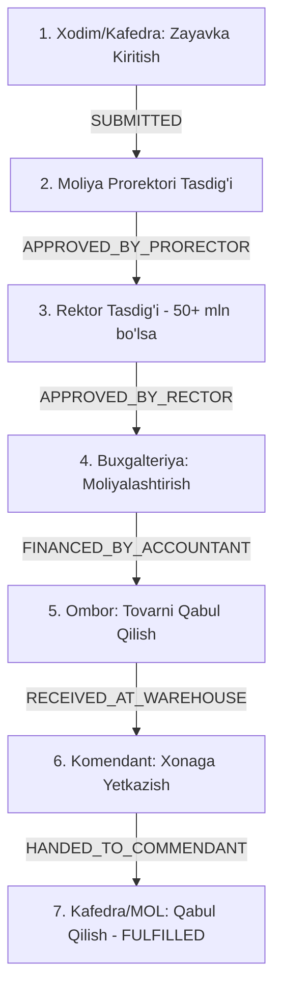

# 📘 UNIVERSITET OMBOR VA AKTIVLARINI BOSHQARISH TIZIMI (UWMS)
## To‘liq Foydalanuvchi Yo‘riqnomasi (Official User Manual)

---

### 📋 MUNDARIJA

1. [Tizim Haqida Umumiy Ma’lumot va Huquqiy Asos](#1-tizim-haqida-umumiy-malumot-va-huquqiy-asos)
2. [Tizim Arxitekturasi va Xavfsizlik Siyosati](#2-tizim-arxitekturasi-va-xavfsizlik-siyosati)
3. [Foydalanuvchi Rollari va Vakolatlar Matritsasi (RBAC)](#3-foydalanuvchi-rollari-va-vakolatlar-matritsasi-rbac)
4. [Asosiy Biznes Jarayonlari (Step-by-Step Workflows)](#4-asosiy-biznes-jarayonlari-step-by-step-workflows)
   - [4.1. 7-Bosqichli Davlat Zayavkasi va Xarid Oqimi](#41-7-bosqichli-davlat-zayavkasi-va-xarid-oqimi)
   - [4.2. Omborga Kirim Qilish (Ingest) va Qoldiqlar Balansi](#42-omborga-kirim-qilish-ingest-va-qoldiqlar-balansi)
   - [4.3. Unikal QR-Stikerlar va Inventar Raqamlash Standarti](#43-unikal-qr-stikerlar-va-inventar-raqamlash-standarti)
   - [4.4. Moddiy Javobgarlikni Topshirish (MOL Handover & Offboarding)](#44-moddiy-javobgarlikni-topshirish-mol-handover--offboarding)
   - [4.5. PWA Oflayn QR Inventarizatsiya va INV-19 Qaydnomasi](#45-pwa-oflayn-qr-inventarizatsiya-va-inv-19-qaydnomasi)
   - [4.6. Oylik Eskirish (Amortizatsiya) Hisoblash Mexanizmi](#46-oylik-eskirish-amortizatsiya-hisoblash-mexanizmi)
   - [4.7. Yaroqsiz Ashyolarni Hisobdan Chiqarish (OS-4 Spisanie Komissiyasi)](#47-yaroqsiz-ashyolarni-hisobdan-chiqarish-os-4-spisanie-komissiyasi)
   - [4.8. Davlat Axborot Tizimlari Bilan Integratsiya (HEMIS & UzASBO)](#48-davlat-axborot-tizimlari-bilan-integratsiya-hemis--uzasbo)
5. [Rasmiy Davlat Namunalaridagi Buxgalteriya Hujjatlari](#5-rasmiy-davlat-namunalaridagi-buxgalteriya-hujjatlari)
6. [Tizim Ma’murligi va Universitet Zaxira Serveri (Disaster Recovery)](#6-tizim-mamurligi-va-universitet-zaxira-serveri-disaster-recovery)
7. [Savollar, Xatoliklar va Texnik Yordam](#7-savollar-xatoliklar-va-texnik-yordam)

---

## 1. Tizim Haqida Umumiy Ma’lumot va Huquqiy Asos

**UWMS (University Warehouse Management System)** — O‘zbekiston Respublikasi Oliy ta’lim, fan va innovatsiyalar vazirligi hamda Iqtisodiyot va moliya vazirligi me’yoriy talablari asosida ishlab chiqilgan avtomatlashtirilgan axborot tizimidir.

### Tizimning Asosiy Maqsadlari:
1. **Shaffoflik:** Universitetdagi har bir stul, parta, kompyuter va laboratoriya uskunasining qaysi xonada va kimning javobgarligida turganini real vaqt rejimida ko‘rsatish.
2. **Qog‘ozbozlikni yo‘qotish:** Dalolatnomalar, aylanma varaqa (obxodnoy list) va yillik inventarizatsiya jarayonlarini to‘liq elektron QR-shtamplar bilan almashtirish.
3. **Moliyaviy nazorat:** Xaridlar byudjet va to‘lov-kontrakt rivojlantirish jamg‘armalari bo‘yicha qat’iy chegaralanishi, kafedralarning oylik sarf limiti (kvotasi) oshib ketishining oldini olish.
4. **Yo‘qotishlardan himoya:** Xodim ishdan bo‘shaganda (offboarding) uning hisobidagi birorta ham mulk qolib ketmasligini va qonuniy dalolatnoma bilan yangi xodimga topshirilishini ta’minlash.

---

## 2. Tizim Arxitekturasi va Xavfsizlik Siyosati

UWMS eng zamonaviy korporativ xavfsizlik standartlariga asoslangan:

- **Frontend:** React 19, ByteDance rasmiy `@arco-design/web-react` kutubxonasi, TanStack React Query, Progressive Web App (PWA).
- **Backend:** NestJS 11, PostgreSQL, Prisma ORM, WebSockets (Real-Time Gateway), AES-256-GCM shifrlash.
- **Xavfsizlik Zanjiri:**
  $$\text{RBAC (Ruxsat)} \longrightarrow \text{Validatsiya (DTO)} \longrightarrow \text{ACID Tranzaksiya} \longrightarrow \text{Audit Log} \longrightarrow \text{WebSocket Xabarnoma}$$
- **Zero Mock / Zero Fallback:** Tizimda soxta yoki hardcoded ma’lumotlar umuman bo‘lmaydi; har bir qiymat to‘g‘ridan-to‘g‘ri ma’lumotlar bazasidan keladi.

---

## 3. Foydalanuvchi Rollari va Vakolatlar Matritsasi (RBAC)

Tizimda universitet iyerarxiyasiga mos 9 ta rasmiy rol mavjud:

| Rol Koding | Rol Nomi | Ruxsat Etilgan Asosiy Amallar |
|---|---|---|
| `EMPLOYEE` | **Xodim / O‘qituvchi** | Yangi zayavka berish, o‘ziga biriktirilgan buyumlarni ko‘rish |
| `MOL` | **Moddiy Javobgar Shaxs** | Kafedra aktivlarini boshqarish, topshirish arizasi (Handover) berish |
| `HEAD_WAREHOUSE` | **Bosh Omborchi** | Kirim qilish (Ingest), qoldiqlarni chiqarish, QR-kod chop etish |
| `COMMENDANT` | **Bino Komendanti** | Xonalarni ko‘rish, buyumlarni joylashtirishni tasdiqlash |
| `VICE_RECTOR_FINANCE` | **Moliya Prorektori** | 50 mln so‘mgacha zayavkalarni tasdiqlash, moliyaviy hisobotlar |
| `RECTOR` | **Universitet Rektori** | 50 mln so‘mdan yuqori zayavkalar, hisobdan chiqarishlarni tasdiqlash |
| `CHIEF_ACCOUNTANT` | **Bosh Hisobchi** | Aylanma vedomost, oylik amortizatsiya, balans, OS-4 tasdiqlash |
| `AUDITOR` | **Ichki Nazorat Auditori**| Xonama-xona QR-inventarizatsiya, oflayn skanerlash, INV-19 |
| `SUPER_ADMIN` | **Tizim Administratori** | Foydalanuvchilar, audit jurnali, zaxira serveri, integratsiyalar |

---

## 4. Asosiy Biznes Jarayonlari (Step-by-Step Workflows)

### 4.1. 7-Bosqichli Davlat Zayavkasi va Xarid Oqimi

Universitetda moddiy boyliklarni sotib olish davlat byudjeti va shartnomaviy qonunlarga muvofiq quyidagi qat’iy 7 bosqich orqali amalga oshadi:



1. **Arizani kiritish:** Xodim `/requests` sahifasida "+ Yangi Talabnoma" tugmasini bosib buyum nomini, sonini va xonasini ko‘rsatadi.
2. **Kafedra kvotasi tekshiruvi:** Tizim sarf materiallari bo‘yicha kafedraning oylik limitini tekshiradi.
3. **Rahbariyat tasdig‘i:** Prorektor va zarur bo‘lsa Rektor arizaning asosliligini ko‘rib chiqib elektron imzolaydi.
4. **Buxgalteriya moliyalashtirishi:** Bosh hisobchi moliyalashtirish manbasini (`BYUDJET` yoki `KONTRAKT`) biriktiradi va to‘lovni tasdiqlaydi.
5. **Ombor kirimi va chiqarilishi:** Tovar universitet omboriga kelgach, omborchi kirim qiladi va buyurtmachi kafedraga chiqaradi.
6. **Komendant orqali xonaga yetkazish:** Komendant buyumni qabul qilib, xonaga joylashtiradi.
7. **Yakuniy qabul qilish:** Mas’ul shaxs (MOL) buyumni qabul qilgach, zayavka `FULFILLED` holatiga o‘tadi va avtomatik ravishda aktivlar ro‘yxatiga kiritiladi.

---

### 4.2. Omborga Kirim Qilish (Ingest) va Qoldiqlar Balansi

- **Kirim qilish:** `/warehouse` sahifasida **"+ Yangi Kirim"** tugmasi bosiladi. Yetkazib beruvchi shartnomasi va hisob-faktura raqamlari kiritiladi.
- **Tranzaksion Butunlik:** Har bir kirim yoki chiqim `prisma.$transaction` orqali ombor qoldig‘i (`Stock.quantity`) bilan sinxronlanadi. Ombor qoldig‘i manfiyga tushib ketishi dasturiy ravishda bloklangan.
- **Sarf materiallari:** Kafedralarga har oy sarflanuvchi materiallar uchun qat’iy limit beriladi. Limitdan ortiqcha berishga urinilganda tizim avtomatik ogohlantiradi.

---

### 4.3. Unikal QR-Stikerlar va Inventar Raqamlash Standarti

Har bir asosiy vositaga unikal formatdagi inventar raqam beriladi:
$$\text{INV-YYYY-XXXXX (Masalan: INV-2026-00142)}$$

- **QR-Kod Strukturasi:** QR-kodda xavfsiz URL va aktivning kriptografik identifikatori joylashadi (`https://uwms.univ.uz/public/verify-asset/...`).
- **QR Stiker Chop Etish:** Termal stiker printer orqali to‘g‘ridan-to‘g‘ri chop etiladi.
- **Qayta chop etish (Dublikat) nazorati:** Agar stiker eskirgan yoki ko‘chib ketgan bo‘lsa, qayta chop etishda sababi so‘raladi va audit jurnaliga yoziladi.

---

### 4.4. Moddiy Javobgarlikni Topshirish (MOL Handover & Offboarding)

Kafedra mudiri yoki laboratoriya mudiri almashganda yoki ishdan bo‘shaganda (offboarding):

1. **Topshirish arizasi yaratish:** `/inbox` bo‘limida **"MOL Mas’uliyatini Topshirish"** tugmasi bosiladi.
2. **Yalpi Dalolatnoma:** Xodim hisobidagi yuzlab kompyuter va mebellar birma-bir emas, yagona **OS-1 Topshirish Dalolatnomasi**ga yig‘iladi.
3. **Komissiya va Ikki Tomonlama Imzolash:**
   - Topshiruvchi (eski MOL);
   - Qabul qiluvchi (yangi MOL);
   - Bosh hisobchi;
   - Bino komendanti.
4. **Mobil QR Imzolash:** Har bir shaxs o‘z smartfonida QR-kodni skanerlab biometrik tasdiqlaydi.
5. **Aylanma Varaqa (Clearance Certificate):** Barcha aktivlar topshirilgach, tizim avtomatik ravishda **"Moddiy Qarzdorligi Yo‘qligi To‘g‘risida Dalolatnoma"**ni PDF holatda shakllantirib beradi.

---

### 4.5. PWA Oflayn QR Inventarizatsiya va INV-19 Qaydnomasi

Universitetning podval laboratoriyalarida yoki internet bo‘lmagan joylarda auditorlik to‘xtab qolmasligi uchun PWA (Progressive Web App) texnologiyasi yo‘lga qo‘yilgan:

```
[Smartfon Skaneri] 
       │
       ▼ (Internet yo'q - Oflayn)
[Brauzer IndexedDB Xotirasi (Navbat)]
       │
       ▼ (Aloqa tiklanganda avtomatik)
[POST /api/audits/:id/batch-scan]
       │
       ▼
[Server Tranzaksiyasi & INV-19 Taqqoslash]
```

1. **Oflayn Kesh:** Aloqa uzilganda skaner avtomatik oflayn rejimga o‘tadi va barcha skanerlangan QR-kodlarni IndexedDB xotirasiga vaqt belgisi bilan to‘playdi.
2. **Ommaviy Sinxronlash:** Aloqa tiklanishi bilan "Sinxronlash" tugmasi orqali barcha ma’lumotlar serverga yuboriladi.
3. **INV-19 Solishtirma Qaydnoma:** Tizim mavjud, ortiqcha va kamomad bo‘lgan buyumlarni aniqlab, davlat standarti bo‘yicha inventarizatsiya vedomostini tuzadi.

---

### 4.6. Oylik Eskirish (Amortizatsiya) Hisoblash Mexanizmi

- **Sahifa:** `/depreciation`
- **Algoritm:** O‘zbekiston davlat buxgalteriya hisobi standartlari (BHMS) bo‘yicha to‘g‘ri chiziqli (Linear) hisoblash usuli:
  $$\text{Oylik eskirish} = \frac{\text{Boshlang‘ich Narx} \times \text{Yillik Norm}}{12 \times 100}$$
- **Jarayon:** Har oyning so‘nggi sanasida Bosh Hisobchi **"Amortizatsiyani Yuritish"** tugmasini bosadi. Tizim barcha aktivlar bo‘yicha eskirishni hisoblab, qoldiq qiymatini yangilaydi va hisobot jadvalini shakllantiradi.

---

### 4.7. Yaroqsiz Ashyolarni Hisobdan Chiqarish (OS-4 Spisanie Komissiyasi)

1. **Tekshiruv dalolatnomasi:** Qayta tiklab bo‘lmaydigan darajada singan yoki muddatini o‘tagan mulklar bo‘yicha kafedra mutaxassisi xulosa kiritadi.
2. **Elektron Ovoz Berish:** Kamida 3 kishidan iborat rektorat komissiyasi a’zolari `/write-offs` sahifasida har bir buyumni hisobdan chiqarishga ovoz beradi (`ROZI` yoki `QARSHI`).
3. **OS-4 Dalolatnomasi:** Yetarli ovoz to‘plangach, Bosh Hisobchi va Rektor tasdiqlaydi, buyum hisobdan chiqariladi va `StockMovement` jurnaliga qayd etiladi.

---

### 4.8. Davlat Axborot Tizimlari Bilan Integratsiya (HEMIS & UzASBO)

- **HEMIS Integratsiyasi (`/integrations`):**
  - Universitetning barcha xodimlari, professor-o‘qituvchilari va kafedralari HEMIS milliy bazasidan to‘g‘ridan-to‘g‘ri REST API orqali sinxronlanadi.
- **UzASBO Integratsiyasi:**
  - Buxgalteriya qoldiqlari, oylik hisobotlar va moliyaviy provodkalar Moliya vazirligining UzASBO tizimiga mos XML/Excel formatida eksport qilinadi.

---

## 5. Rasmiy Davlat Namunalaridagi Buxgalteriya Hujjatlari

Tizimda shakllanadigan har bir hujjat O‘zbekiston davlat ta’lim muassasalari standartiga to‘liq mos keladi:

1. **OS-1:** Asosiy vositalarni qabul qilish va topshirish dalolatnomasi.
2. **OS-2:** Universitet ichki harakatlanish (Kafedralararo ko‘chirish) nakladnoyi.
3. **OS-4:** Foydalanishga yaroqsiz ashyolarni hisobdan chiqarish (Spisanie) dalolatnomasi.
4. **INV-19:** Qayta sanash va inventarizatsiya natijalari solishtirma qaydnomasi.
5. **Clearance Certificate:** Moddiy javobgarlik aylanma varaqasi (Obxodnoy list).

> **QR-Himoya Shtampi:** Har bir rasmiy hujjatning pastki o‘ng burchagida davlat elektron hujjati ekanligini tasdiqlovchi QR-shtamp qo‘yiladi. Istalgan shaxs ushbu QR-kodni skanerlab, hujjatning asl nusxasi va tasdiqlovchilarini `/public/verify-doc/:docNumber` sahifasida tekshirishi mumkin.

---

## 6. Tizim Ma’murligi va Universitet Zaxira Serveri (Disaster Recovery)

Tizim ma’lumotlari xavfsizligi va qonuniy me’yorlarga ko‘ra, barcha zaxiralar universitetning o‘z ichki serverlarida saqlanadi:

- **Shifrlash:** Barcha zaxira nusxalari **AES-256-GCM** kriptografik algoritmi bilan shifrlanadi (`.dump.enc`).
- **Universitet Serveri:** Nusxalar universitetning alohida zaxira fayl serveriga (NFS / SMB / Tarmoq diski) yoki ichki MinIO klasteriga yoziladi.
- **Disaster Recovery:** Asosiy serverning qattiq diski to‘liq ishdan chiqqan taqdirda ham, tizim universitet zaxira serveridan ma’lumotlarni avtomatik tortib olib, SHA-256 yaxlitlik xeshini tasdiqlagan holda 100% tiklashga qodir.
- **Avtomatik Reja:** Har kuni tungi soat 02:00 da tizim avtomatik kunlik zaxira nusxasini yaratadi.

---

## 7. Savollar, Xatoliklar va Texnik Yordam

| Muammo | Mumkin bo‘lgan sabab | Yechim |
|---|---|---|
| **Tizimga kirib bo‘lmayapti (401)** | Parol noto‘g‘ri yoki hisob faol emas | Parolni tekshiring yoki administratorga murojaat qiling |
| **Zayavka qizil rangda ogohlantirmoqda** | Kafedraning oylik kvotasi yetarli emas | Moliya Prorektoridan qo‘shimcha limit ruxsati so‘rang |
| **QR-kod skaner qilinmayapti** | Kamera ruxsati yo‘q yoki stiker shikastlangan | Brauzer sozlamalarida kameraga ruxsat bering |
| **Oflayn yozuvlar serverga bormayapti** | Internet aloqasi to‘liq ulanmagan | Aloqa barqarorlashgach "Sinxronlash" tugmasini bosing |

---

*Hujjat versiyasi: 2.0 (2026-yil)*  
*Muallif: UWMS Loyihasi Ishchi Guruhi va Axborot Texnologiyalari Markazi*
